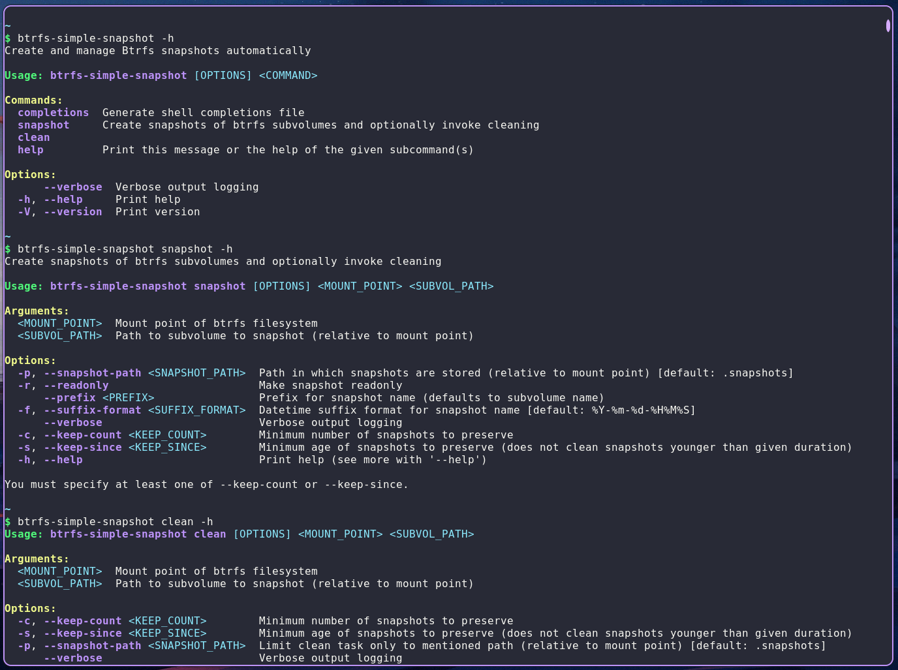

# btrfs-simple-snapshot

Yet another BTRFS snapshot management tool to automate snapshot while removing the older ones

Paired with a cron job or timer, you can easily create snapshots of btrfs subvolumes and maintain a particular number of snapshots at disposal for simpler backup solution.



---

## Features

- Create snapshots of btrfs subvolumes and organize them with intuitive naming convention
- Cleanup older snapshots
- Customizable snapshot naming convention
- Customizable snapshot cleanup policy (number of snapshots and/or age of snapshots)
- Dedicated clean command to remove older snapshots without creating new ones
- Auto cleanup on snapshot creation
- Simple CLI tool with proper help docs accessible using `--help`
- Written in Rust 🦀 with proper error handling and logging

---

## Installation

### Using Nix flakes

`btrfs-simple-snapshot` is available as a flake. You can add it to your flake configuration as follows:

```nix
{
  inputs.btrfs-simple-snapshot.url = "github:dvishal485/btrfs-simple-snapshot/v0.1.4"; # Replace with the latest version
  outputs = { self, nixpkgs, btrfs-simple-snapshot }: {
    nixosConfigurations.my-host = nixpkgs.lib.nixosSystem {
      system = "x86_64-linux";
      modules = [
        { config, pkgs, ... }:
        {
          environment.systemPackages = [
            btrfs-simple-snapshot
          ];
        }
      ];
    };
  };
}
```

This will install the `btrfs-simple-snapshot` binary in your system along with shell completions, which you can run manually or automate using systemd unit.

For automation, you can also use the nixos-module provided with the flake to use systemd unit with timer to automate snapshot creation and cleanup.

This is an example for reference which mounts the btrfs subvolume to a temporary location and then creates snapshots of the `home` subvolume, keeping atleast the last 5 snapshots while removing the snapshots older than 1 week.

```nix
{
  inputs,
  pkgs,
  ...
}:
{
  imports = [ inputs.btrfs-simple-snapshot.nixosModules.default ];

  services.btrfs-simple-snapshot = {
    enable = true;
    tasks =
      let
        tmp_dir = "/var/tmp/btrfs-simple-snapshot";
        mount_point = "${tmp_dir}/root";
      in
      [
        {
          pre-cmd = ''
            ${pkgs.coreutils}/bin/mkdir -p ${mount_point}
            ${pkgs.util-linux}/bin/mount -o noatime -o compress=zstd /dev/disk/by-label/nixroot ${mount_point}
          '';
          post-cmd = ''
            ${pkgs.util-linux}/bin/umount ${mount_point}
            ${pkgs.coreutils}/bin/rm -r ${mount_point}
          '';
          mount-point = "${tmp_dir}/root";
          subvolume = "home";
          snapshot-path = "backups";
          snapshot = {
            enable = false;
            args = {
              readonly = true;
              suffix-format = "%Y-%m-%d-%H.%M.%S";
              prefix = null;
            };
          };
          cleanup = {
            enable = true;
            args = {
              keep-count = 5;
              keep-since = "1 week";
            };
          };
        }
      ];
    config = {
      verbose = true;
      interval = "daily";
    };
  };
}
```

Cachix cache is available for [btrfs-simple-snapshot](https://app.cachix.org/cache/btrfs-simple-snapshot) for faster build and installation.

```nix
{
  nix.settings = {
    substituters = [
      "https://btrfs-simple-snapshot.cachix.org"
    ];

    trusted-public-keys = [
      "btrfs-simple-snapshot.cachix.org-1:fzqd4nDTzaoXe0sPf/y0lrrz/sm9kyJhuYt87hRMb58="
    ];
  };
}
```

### Building from source

> [!NOTE]
> `btrfs-progs` is required as a runtime dependency to interact with btrfs filesystem.
> Make sure to have it installed on your system.

1. Make sure to have [Rust installed on your system](https://rustup.rs/)
2. Clone the repository and change directory to the cloned repository
3. Run `cargo install --path .`
4. The binary `btrfs-simple-snapshot` should be now available in your `PATH`

For shell completions, you can run `btrfs-simple-snapshot completions <SHELL>` to generate shell completion script.

---
